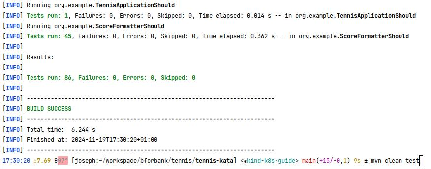
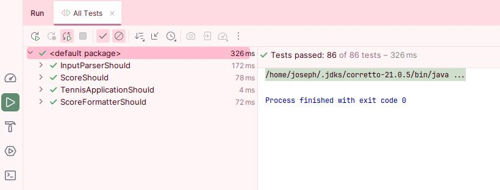
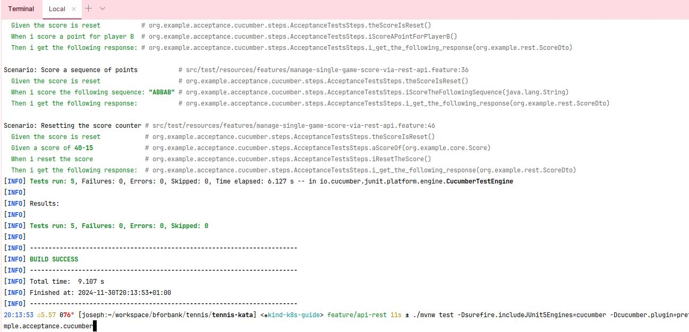
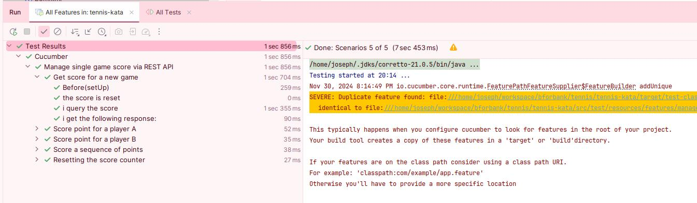

# kata-tennis

Le but de ce kata est d'implémenter une méthode permettant de compter le score d'un jeu.

## Pré-requis

* Java 21
* (optionnel) Maven, ou utilisation de Maven Wrapper

## Éxécution des tests unitaires
### via maven
`mvn clean test` ou  `./mvnw clean tests`

### via l'IDE 

Ici avec Intellij par exemple

## Éxécution des tests d'acceptance

### via CLI / Maven

1. `make run-acceptance-tests`
2. `./mvnw test -Dsurefire.includeJUnit5Engines=cucumber -Dcucumber.plugin=pretty -Dcucumber.features=src/test/resources/features/ -Dcucumber.glue=org.example.acceptance.cucumber`
3. `mvn clean verify -Pacceptance`

### via l'IDE

Ici avec Intellij par exemple

Ça fait beaucoup de manières de lancer les tests d'acceptance. Voyons celle qui se démarque à l'usage, et celles qui vont vieillir moins bien. J'ai une préférence pour la version Makefile.
